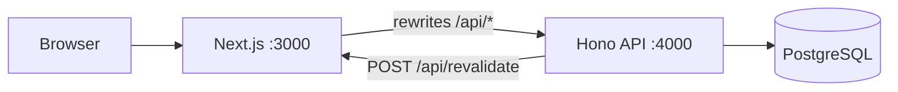

# Monorepo layout

Two packages: a **Next.js frontend** and a **standalone Node API** backed by **PostgreSQL** (Prisma).

| Folder | Package | Role |
|--------|---------|------|
| `frontend/` | `@carewell/frontend` | Next.js UI — pages, components, middleware |
| `backend/` | `@carewell/backend` | Hono API on port 4000 — Prisma, CMS writes, admin auth, uploads |

Public URLs stay the same in the browser (`/`, `/admin`, `/api/*`). In development, Next **rewrites** most `/api/*` traffic to the API server so cookies and relative fetches keep working on port 3000.

## Architecture



**Next-only routes** (still implemented inside the frontend app):

- `/api/draft`, `/api/disable-draft` — Sanity preview / draft mode
- `/api/revalidate` — on-demand ISR (`revalidatePath`)

Everything else under `/api/*` is handled by `@carewell/backend`.

SSR pages may still import `@carewell/backend/lib/*` for CMS reads (same repo). A future step is optional REST endpoints for reads so the frontend bundle never touches Prisma.

## Commands (from repo root)

```bash
npm install
docker compose up -d          # Postgres on localhost:5433
npm run db:generate
npm run db:migrate

npm run dev:all               # API :4000 + Next :3000
npm run dev:api               # API only
npm run dev:web               # Next only
npm run dev:fresh             # clean .next, then dev:all

npm run build                 # frontend production build
npm run db:studio             # Prisma Studio (backend workspace)
```

Environment files (`.env.local`) live at the **repo root**. The API loads them from `backend/src/server.ts`; Next loads them via `next.config.mjs`.

| Variable | Purpose |
|----------|---------|
| `DATABASE_URL` | PostgreSQL connection string |
| `API_URL` / `API_PORT` | Standalone API (default `http://localhost:4000`) |
| `FRONTEND_URL` | API → Next revalidation calls |
| `NEXT_PUBLIC_SITE_URL` | Canonical site URL for the browser |

## Deploy (single service — recommended on Render)

1. **Web service** — build: `npm install && npm run db:generate && npm run build`; start: `npm run start`.
2. Env: `DATABASE_URL`, `ADMIN_SESSION_SECRET` (16+ chars), `ADMIN_PASSWORD`, `NEXT_PUBLIC_SITE_URL`, `FRONTEND_URL` (same as public URL). Leave `API_URL` unset.
3. Run migrations once: `npm run db:migrate` (or `prisma migrate deploy` with `DATABASE_URL`).

## Deploy (split API + frontend)

1. **API** — `npm run start -w @carewell/backend` with `API_PORT=$PORT`, `DATABASE_URL`, secrets.
2. **Frontend** — set `API_URL` to the API’s public HTTPS origin so Next proxies `/api/*` and `/uploads/*`.
3. Set `FRONTEND_URL` on the API to the public Next URL for cache revalidation.

`netlify.toml` today publishes only the Next app; point `API_URL` at your hosted API when you split deploys.

## Root folder (outside frontend/backend)

| Item | Purpose |
|------|---------|
| `package.json` | npm workspaces + `dev:all` |
| `docker-compose.yml` | Local Postgres |
| `scripts/` | Imports, scrapers, one-off migrations |
| `data/` | Fixtures (legacy URL map, scrape data) |
| `redirects.migration.json` | Build-time redirects (`frontend/next.config.mjs`) |

Runtime middleware: **`frontend/src/middleware.ts`** (redirects + admin gate).

## Imports

- Frontend UI: `@/*` → `frontend/src/*`
- API + shared server code: `@/*` → `backend/src/*` inside the backend package
- Frontend webpack aliases (SSR): `@/lib`, `@/sanity` → `backend/src/lib`, `backend/src/sanity` (until reads move behind HTTP)
